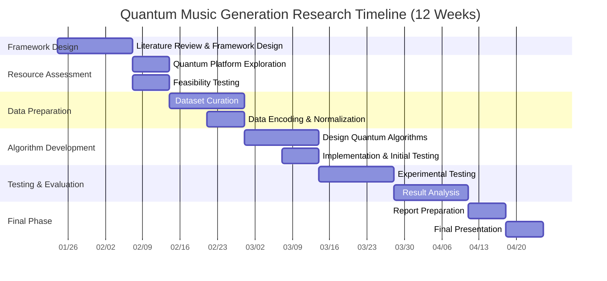

# **Research Protocol: Quantum Music Generation**
**(Semester Plan)**  
  Dr David B. Smith  
  2025-01-24  
  Center for Holistic Integration  
  NYC College of Technology  

**Advisors**  
 - Professor Oleg Berman - Physics  
 - Professor David B. Smith - Emerging Media  

**Research Team**  
 - Alyssa Burtsev  
 - Mellisa Demolari  
 - Elizabeth Frias  
 - Houke Gao  
 - Stefanie Rivera
 - Sunima Dangol

## **1 Introduction**

This research project explores the use of quantum computing in music analysis and generation, focusing on operatic works by composers such as Mozart and Rossini. The project will analyze musical data, identify patterns, and experiment with generating new compositions or variations using quantum-compatible methodologies.

The semester-long activity will focus on developing a foundational framework, assessing quantum computing resources, preparing datasets, and conducting initial tests.

### **1.2 Objectives**

1. **Focus Areas:**
   - Evaluate quantum-compatible data formats, focusing on symbolic musical data (e.g., MIDI, MusicXML).
   - Establish access to quantum computing resources and confirm feasibility.
   - Develop and test basic algorithms for music analysis and generation.

2. **Semester Goals:**
   - Build a foundational understanding of quantum music processing.
   - Conduct small-scale experiments with curated datasets.
   - Generate preliminary results to guide further research.

## **2. Personnel**

### **2.1 Project Leadership**

1. **Professor Oleg Berman (Physics)**
   - **Role:** Quantum Computing Advisor
   - **Responsibilities:**
     - Oversee the integration of quantum computing principles.
     - Provide guidance on algorithmic design and resource access.

2. **Professor David B. Smith (Emerging Media)**
   - **Role:** Project Coordinator and Creative Lead
   - **Responsibilities:**
     - Direct creative and technical aspects of the project.
     - Ensure cohesion between music theory and computational approaches.

### **2.2 Student Research Team (Roles tba)***
   - Mellisa Demolari
   - Elizabeth Frias
   - Houke Gao
   - Stefanie Rivera
   - Alyssa Burtsev  
    
## **3. Project Setup**

In order to manage content, deliverables, and code integrity, the research team will need to claim access to the different productivity resources listed below.  Each researcher must ensure that they are able to access each of these resources.  Detailed instructions will be found once this proposal is accepted.   

### **3.1 Tools and Platforms**

#### **3.1.1 [GitHub](https://github.com/) (Version Control and Project Management)**
- **Purpose:** Centralize code development, project documentation, and version control.
- **Action Required:** 
  - Each student must create a GitHub account if they don’t already have one.
  - Students will be added to the project repository for collaboration.
  - Ensure that part of your GitHub user name is your real name (see [setting up your user name in GitHub](https://docs.github.com/en/get-started/getting-started-with-git/setting-your-username-in-git))

#### **3.1.2 [Zotero](https://www.zotero.org/) (Research Documentation and Citation Management)**
- **Purpose:** Organize and cite research materials efficiently in a shared repository
- **Action Required:**
  - Each student must create a free [Zotero account](https://www.zotero.org/user/register/) and join the shared group library [**Quantum_AI_Music**](https://www.zotero.org/groups/5772697/quantum_ai_music) for the project.
  - Students will be responsible for adding and tagging relevant resources.

#### **3.1.3 [Discord](https://discord.com/) (Informal Communication)**
- **Purpose:** Facilitate real-time collaboration and informal discussion.
- **Action Required:**
  - Join the Discord Server [Quantum_AI_Music](https://discord.gg/qKh9g5CE) (This link expires on Feb 22 2025. Contact dbs if needing a new invitation).
  - Ensure that your display name is your real name, and if not, then a server nickname will need to be assigned (see [here](https://support.discord.com/hc/en-us/articles/12620128861463-New-Usernames-Display-Names#:~:text=Display%20names%20are%20not%20unique,appear%20as%20your%20display%20name.)  
  - Set up channels for topics such as:
    - General Discussions
    - Data Preparation
    - Algorithm Development
    - Quantum Computing Resources
    - Documentation and Dissemination

### **3.2. Determining Student Contributions**
Each researcher will be making different contributions to the overall project.  In order to appropriately assess this, it is important that each researcher provide information as requested in 3.2.1 below.  

#### **3.2.1 Background and Aspirations**
- **Purpose:** Understand each student’s expertise and goals to align roles and tasks effectively.
- **Action Required:**
  - Each student submits a brief summary addressing:
    - Their academic and technical background.
    - Relevant skills or experiences (e.g., programming, music analysis, research).
    - Aspirations for this project (e.g., skills they hope to develop, career interests).
  - Summaries should be shared via email or a shared document repository.

#### **3.2.2 Initial Research Tasks**
- **Purpose:** Ensure all team members have a foundational understanding of the project context.
- **Action Required:**
  - Students will review introductory materials on:
    - Quantum computing basics.
    - Musical syntax and structure.
    - Tools for symbolic music data (e.g., MIDI, MusicXML).  

### **3.3 Additional Setup Activities**

#### **3.3.1 Resource Access**
- **Purpose:** Ensure students have access to necessary platforms and tools.
- **Action Required:**
  - Confirm access to quantum computing resources, such as IBM Quantum.
  - Provide instructions for accessing project-specific tools and datasets.

#### **3.3.2 Team Collaboration Infrastructure**
- **Purpose:** Establish infrastructure for collaboration and task tracking.
- **Action Required:**
  - Set up a shared GitHub repository for task management and document storage.

#### **3.3.3 Orientation and Training**
- **Purpose:** Equip students with the knowledge and tools they need to contribute effectively.
- **Action Required:**
  - Schedule an orientation meeting to outline the project goals and methodology.
  - Provide optional training sessions or resources for GitHub, Zotero, and relevant programming languages or frameworks.

### **3.4. Communication Plan**

- **Purpose:** Ensure clear and consistent communication across the team.
- **Action Required:**
  - Define the frequency and format of meetings (e.g., weekly check-ins on Zoom or Discord).
  - Assign a note-taker for meetings to document key decisions and action items.
  - Encourage asynchronous updates via GitHub or Discord for ongoing tasks.

### **3.5. Deliverables for Setup Phase**

1. All students signed up for GitHub, Zotero, and Discord.
2. Completed student summaries outlining background and aspirations.
3. Shared project folder and repositories set up with initial access granted.
4. Orientation meeting held with clear goals and timelines established.
5. Initial research materials distributed and reviewed by students.

### **3.6 Potential Student Research Roles**

While individual students may assume specific primary roles, responsibilities may overlap, allowing researchers to contribute to multiple areas as necessary. Collaboration and adaptability will be emphasized throughout the project.  the following roles are suggestions, and the overall research design will be determined once these are formalized using information from **3.2.1**

#### **3.6.1 Data Specialist**
   - **Responsibilities:**
     - Curate, preprocess, and organize datasets in MIDI and MusicXML formats.
     - Implement transcription tools to convert audio recordings into symbolic representations.
     - Ensure data is normalized and compatible with quantum processing requirements.

#### **3.6.2. Quantum Systems Specialist**
   - **Responsibilities:**
     - Explore and set up quantum computing resources (e.g., IBM Quantum).
     - Conduct feasibility tests on small-scale datasets.
     - Collaborate with the team to ensure efficient resource use and platform compatibility.

#### **3.6.3. Algorithm Developer**
   - **Responsibilities:**
     - Design and implement quantum-compatible algorithms for feature extraction and generation.
     - Encode musical parameters (e.g., pitch, rhythm) for quantum operations.
     - Collaborate with other team members to refine algorithmic outputs.

#### **3.6.4. Music Syntax Analyst**
   - **Responsibilities:**
     - Analyze musical syntax and stylistic patterns within datasets.
     - Provide insights into the semantic relationships between musical elements.
     - Collaborate on refining algorithmic outputs to ensure stylistic coherence.

#### **3.6.5. Documentation and Dissemination Lead**
   - **Responsibilities:**
     - Document research activities, processes, and findings.
     - Prepare final reports and presentations for internal and external stakeholders.
     - Develop materials for dissemination, such as public-facing summaries or visualizations.

### **4. Next Steps for Role Identification**

1. **Task Identification:**
   - Break down the methodology into smaller, actionable tasks aligned with the project timeline.
   - Define overlapping areas where collaboration is essential, such as data preparation feeding directly into algorithm development.

2. **Role Assignment:**
   - Discuss student interests and skills to match them with primary roles while allowing flexibility for cross-functional contributions.

3. **Training and Resources:**
   - Provide learning materials on:
     - Quantum computing basics.
     - Music syntax and symbolic data analysis.
     - Algorithm development using quantum-compatible platforms.

4. **Collaboration and Communication:**
   - Establish regular team check-ins to ensure integration across roles.
   - Use collaborative tools like shared documents, version control, and communication platforms for seamless coordination.

## **5. Methodology**

### **5.1 Process Stages**

#### **5.1.1Research and Framework Design (Weeks 1-2)**
- **Objective:** Establish a theoretical foundation for quantum music processing.
- **Activities:**
  - Review literature on quantum computing, algorithmic composition, and TDA.
  - Define a simplified data pipeline tailored for semester goals.
  - Identify key parameters for encoding (e.g., pitch, rhythm).

### **5.1.2 Quantum Resource Assessment (Weeks 2-3)**
- **Objective:** Confirm access to quantum platforms and assess feasibility.
- **Activities:**
  - Explore IBM Quantum ([IBM Q](https://quantum.ibm.com/)) and other platforms.
  - Conduct small-scale feasibility tests using sample data.
  - Establish protocols for encoding and uploading data to quantum systems.

### **5.1.3 Data Preparation and Representation (Weeks 3-5)**
- **Objective:** Prepare datasets for initial quantum experiments.
- **Activities:**
  - Curate a small dataset of operatic MIDI or MusicXML files.
  - Normalize data formats and encode basic parameters (e.g., pitch, rhythm).
  - Implement encoding methods suitable for quantum processing.

### **5.1.4 Algorithm Development (Weeks 5-7)**
- **Objective:** Develop simple algorithms for music analysis and generation.
- **Activities:**
  - Design basic quantum-compatible algorithms for feature extraction (e.g., Grover’s or QAOA).
  - Implement sampling methods to explore musical possibilities.
  - Test algorithms on small datasets to assess functionality.

### **5.1.5 Experimental Testing and Evaluation (Weeks 7-10)**
- **Objective:** Conduct initial experiments and evaluate outputs.
- **Activities:**
  - Test quantum algorithms on curated datasets.
  - Analyze outputs for harmonic complexity and coherence.
  - Collect feedback from team members or subject matter experts.

### **5.1.6 Final Reporting and Dissemination (Weeks 11-12)**
- **Objective:** Document findings and share results.
- **Activities:**
  - Prepare a report summarizing the semester's progress.
  - Present preliminary findings to stakeholders.
  - Propose directions for future research based on semester results.

### **5.2 Timeline**

| Phase                          | Duration   | Milestones                                    |
|--------------------------------|------------|----------------------------------------------|
| **Framework Design**           | Weeks 1-2  | Literature review, framework defined.        |
| **Resource Assessment**        | Weeks 2-3  | Quantum platform access confirmed.           |
| **Data Preparation**           | Weeks 3-5  | Curated dataset and encoding completed.      |
| **Algorithm Development**      | Weeks 5-7  | Basic algorithms implemented.                |
| **Testing and Evaluation**     | Weeks 7-10 | Experimental results analyzed.               |
| **Final Reporting**            | Weeks 11-12 | Report and presentation completed.           |

### **5.3 Proposed Gantt Chart**

## **6. Deliverables**

1. **Week 2:** Defined framework and literature summary.
2. **Week 3:** Feasibility report on quantum platform access.
3. **Week 5:** Curated dataset and encoding protocols.
4. **Week 7:** Basic quantum-compatible algorithms.
5. **Week 10:** Preliminary experimental results.
6. **Week 12:** Final report and presentation.

### **6.1 Adjustments for Ambition**
If time allows, extend testing and evaluation to explore more complex datasets or add refinements to algorithms. Focus primarily on establishing a robust foundation for future iterations.

This  timeline ensures a manageable scope while laying the groundwork for a more comprehensive project in subsequent semesters.

## 7. Contact

Project Management Lead: is Dr. David B. Smith   
dsmith@citytech.cuny.edu  
[Website](https://sites.google.com/view/drdavidbsmith/home)  
Discord: @davidbrucesmith  
